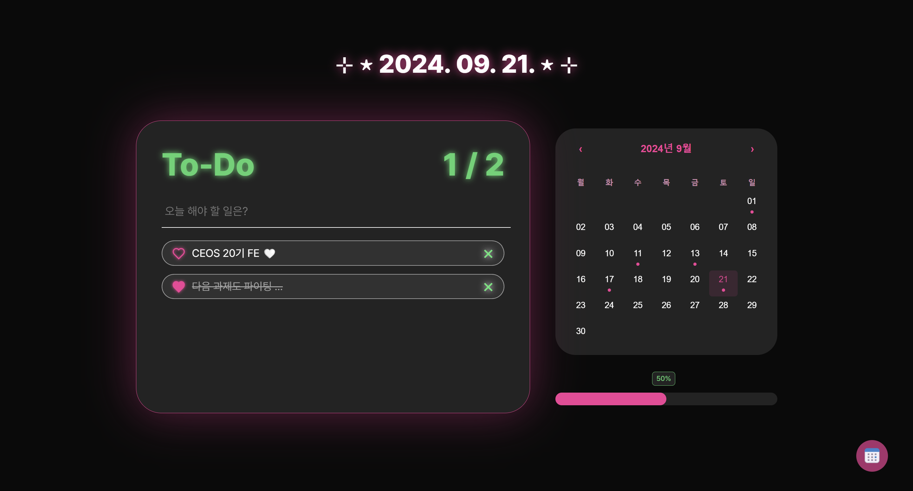

# 2주차 미션: React-Todo

 

## [🪄 결과물](https://react-todo-20th-ys.vercel.app/)

### 🩵 구현 기능

- 기존 vanilla-todo의 기능들 전부 리액트로 리팩토링

- 투두리스트 항목 클릭해서 수정할 수 있는 기능 추가

- 캘린더 기능 추가 (날짜별로 투두 저장 및 조회 가능, todo 있는 날은 dot 표시)

- 진행률 표시 기능 추가 (완료한 투두 / 전체 투두의 비율 퍼센트로 계산)

- word-break 문제 수정

### 🩵 느낀 점

바닐라 JS만으로 작업해야 했던 1주차 과제와 비교하면 확실히 훨씬 더 효율적으로 코드를 관리할 수 있었다. 바닐라 JS로 작성할 때는 함수들을 하나의 파일에 모두 넣다 보니 기능을 추가할 때마다 코드가 복잡해지고, 원하는 부분을 찾는 것도 힘들었다. 반면, 리액트로는 컴포넌트를 기능별로 분리하고 구조를 깔끔하게 만들 수 있었기 때문에 코드의 가독성이 좋아지고, 새로운 기능을 추가하는 것도 훨씬 수월했다. 특히 react-calendar 라이브러리를 사용해서 이전에 바닐라 JS로 구현하지 못했던 캘린더 기능을 빠르게 추가할 수 있었다. 다만 이번에 상태 관리 라이브러리를 사용하지 못해서 모든 상태를 props로 전달해야 했었는데, (프로젝트의 규모가 크지 않아 별 문제는 없었지만) 그래도 살짝 번거로웠다. 그리고 모바일 반응형 디자인같은 디테일 요소를 시간 부족으로 인해 구현하지 못했는데, 이 부분도 약간의 아쉬움으로 남았다.
 

## 💡Key Questions

### 1️⃣ Virtual-DOM은 무엇이고, 이를 사용함으로서 얻는 이점은 무엇인가요?

Virtual-DOM은 말 그대로 가상 DOM, 즉 실제 DOM의 사본이다. 이 사본은 JS 객체 형태로 메모리 안에 저장되어 있다. 실제 DOM을 조작하는 건 보통 브라우저가 html을 탐색해 특정 element를 찾고, 해당 element와 자식 element들을 dom에서 제거한 뒤 새롭게 수정된 elememt로 교체하는 작업으로 이루어진다. 그러나 **실제 DOM을 직접 조작하는 것은 비효율적**이다. DOM 조작이 작은 트리의 정보를 업데이트한다던가, 빠른 알고리즘을 사용한다던가 하는 조간 하에서는 크게 무리가 있는 작업은 아니지만, 이를 계속 반복적으로 수행한다면 충분히 무거운 작업이 될 수 있다. UI 업데이트가 빈번하게 일어나는 서비스 같은 경우에는 DOM을 직접 조작하는 방식을 지속적으로 사용하면 페이지가 느려질 수 있다.

이런 문제를 해결하기 위해서 리액트는 항상 두 개의 가상 DOM 객체를 가지고 있다. 하나는 **렌더링 이전 화면 구조를 나타내는 가상 DOM**이고, 다른 하나는 **렌더링 이후에 보이게 될 화면 구조를 나타내는 가상 DOM**이다.

리액트 컴포넌트가 렌더링될 때 가상 DOM이 업데이트 되는데, 이때 실제 UI가 변경되는 것이 아니라, 메모리 상의 가상 DOM이 업데이트된다. 그리고 변경된 가상 DOM과 이전의 가상 DOM을 비교하는데, 이를 **Diffing**이라고 한다. Diffing은 효율적인 알고리즘을 사용해 진행되기 때문에 어떤 요소에 차이가 있는지 신속하게 파악할 수 있다. 리액트는 파악한 정보를 토대로 차이가 발생한 부분만을 실제 돔에 적용한다. 이 과정을 **Reconciliation**이라고 한다. Reconciliation은 Batch Update 방식을 사용하는데, 이는 **변경된 모든 요소들을 집단화시켜 한 번에 실제 DOM에 적용시키기 때문에 매우 효율적**이라고 할 수 있다. (element들을 별개로 하나하나 그려주는 게 아니라 한 번에 받아와 실제 DOM에 적용시켜준다는 것)

### 2️⃣ React.memo(), useMemo(), useCallback() 함수로 진행할 수 있는 리액트 렌더링 최적화에 대해 설명해주세요.

- `React.memo()` : `React.memo()`는 Higher-Order Component(컴포넌트를 인자로 받아서 새로운 컴포넌트를 return해주는 구조의 함수)로, **props가 변경되지 않는 한 컴포넌트를 다시 렌더링하지 않도록 하는 역할**을 한다. 기본적으로 리액트는 부모 컴포넌트가 리렌더링되면 자식 컴포넌트도 모두 리렌더링한다. 이때 자식 컴포넌트가 동일한 props를 받고 있음에도 불구하고 불필요하게 리렌더링되는 경우가 발생하는데, `React.memo()`는 이를 방지하여 성능을 향상시킨다. **=> 자주 변경되지 않는 데이터나 상태를 가진 컴포넌트에 적합함!** 그러나 props 비교를 위한 추가적인 메모리와 연산이 필요하기 때문에 무조건 모든 컴포넌트에 사용하는 것은 오히려 성능 저하를 유발할 수 있다. 최적화가 필요한 컴포넌트에만 선택적으로 사용해야 한다.
- `useMemo()` : `useMemo()`는 특정 연산의 결과를 메모이제이션하여, **불필요한 재계산을 방지하는 역할**을 한다. 컴포넌트가 리렌더링될 때마다 계산 비용이 높은 작업이 반복적으로 수행되는 경우, 이 작업의 결과를 캐시하여 이전 값을 재사용하도록 돕는다. 이는 복잡한 연산이나 데이터 변환 작업이 포함된 코드에서 성능 최적화에 유용하다. 그러나 메모이제이션 자체에도 메모리와 연산 비용이 들기 때문에 너무 간단한 연산에서는 오히려 사용하지 않는 것이 성능에 더 유리할 수 있다. **=> 리렌더링될 때마다 동일한 값을 유지해야 하는, 최적화가 필요한 연산에만 사용하는 것이 좋음!**

- `useCallback()` : `useCallback()`은 함수를 메모이제이션하여, **불필요한 함수 재생성을 방지하는 역할**을 한다. 컴포넌트가 리렌더링될 때마다 함수가 새로 생성되는 것을 막고, 동일한 함수를 재사용할 수 있도록 한다. 특히 자식 컴포넌트에 함수형 props를 전달할 때, 부모 컴포넌트의 리렌더링으로 인해 자식 컴포넌트가 불필요하게 리렌더링되는 걸 막는 데 유용하다. 그러나 이를 남용할 경우 오히려 코드가 복잡해지고 메모리 사용량이 증가할 수 있다. **=> 자식 컴포넌트에 전달하는 함수가 자주 변경되지 않을 때 사용하는 것이 좋음!**

### 3️⃣ React 컴포넌트 생명주기에 대해서 설명해주세요.

**_Mounting(생성) - Updating(업데이트) - Unmounting(제거) 단계로 나뉜다._**

- **Mounting (컴포넌트가 생성될 때)**: 컴포넌트가 처음 생성되어 DOM에 삽입될 때 실행되는 단계이다.

  - `constructor()` : 컴포넌트 클래스의 생성자로, 컴포넌트가 만들어질 때마다 호출된다. 주로 초기 state를 설정하거나 메서드를 바인딩할 때 사용된다.
  - `getDerivedStateFromProps()` : props에서 파생된 state를 업데이트하는 역할을 한다. 컴포넌트가 마운트되기 전에 호출되며, props에 따라 state를 설정할 수 있다.
  - `render()` : 해당 함수 내 리턴 코드를 통해 DOM의 기능과 모양 정보가 담긴 React 요소를 반환한다. 컴포넌트의 UI를 정의하는 부분으로, 필수적으로 구현해야 한다.
  - `componentDidMount()` : 컴포넌트 생성부터 렌더링(종료)까지 진행된 후 호출되는 함수이다. 이 시점에서는 DOM에 접근할 수 있으며, 외부 데이터 요청이나 이벤트 리스너 등록 등의 작업을 수행할 수 있다.

- **Updating (컴포넌트가 업데이트될 때)** : 컴포넌트의 props 또는 state가 변경되어 리렌더링될 때 실행되는 단계이다.

  - `getDerivedStateFromProps()` : props에서 파생된 state를 업데이트하는 역할을 한다. 컴포넌트가 업데이트되기 전에 호출되며, props에 따라 state를 설정할 수 있다.
  - `shouldComponentUpdate()` : 컴포넌트가 업데이트될지 여부를 결정하는 함수로, true를 반환하면 리렌더링이 진행되고 false를 반환하면 렌더링을 중단한다. 성능 최적화를 위해 주로 사용된다.
  - `render()` : 해당 함수 내 리턴 코드를 통해 DOM의 기능과 모양 정보가 담긴 React 요소를 반환한다. props나 state의 변화에 따라 UI를 갱신하는 함수로, 필수적으로 구현해야 한다.
  - `getSnapshotBeforeUpdate()` : DOM이 업데이트되기 직전에 호출되며, 이전 상태나 스크롤 위치 등의 정보를 캡처할 수 있다. 이 메서드에서 반환된 값은 componentDidUpdate()에서 사용된다.
  - `componentDidUpdate()` : 컴포넌트가 업데이트된 후 호출된다. DOM 조작, 외부 데이터 요청 등 업데이트 후 필요한 작업을 수행할 수 있다.

- **Unmounting (컴포넌트가 DOM에서 제거될 때)**: 컴포넌트가 DOM에서 완전히 제거될 때 실행되는 단계이다.
  - `componentWillUnmount()` : 컴포넌트가 DOM에서 제거되기 직전에 호출된다. 주로 타이머 정리, 이벤트 리스너 해제, 네트워크 요청 취소 등 정리 작업을 수행하는 데 사용된다.
